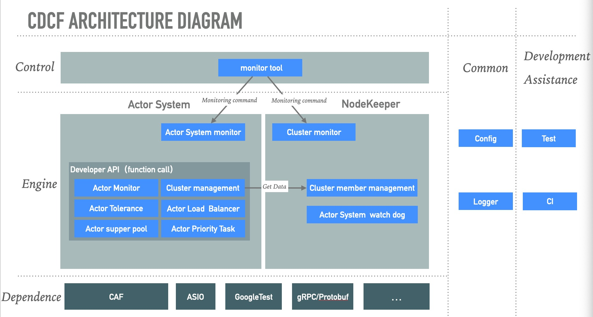
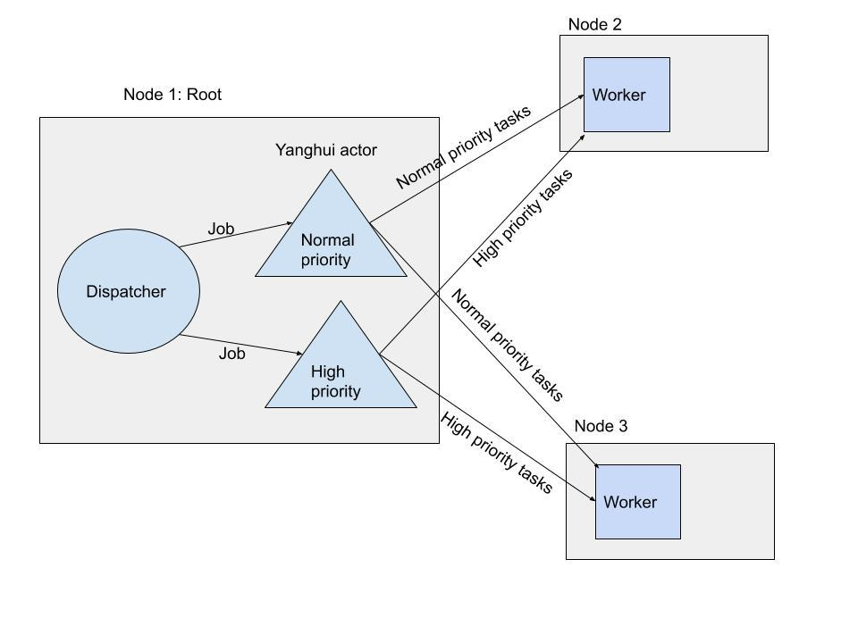

# CDCF Develop Document

## 1 Introduction
CDCF full name is C++ Distributed Computing Framework. It was born for high performance. 
It is to fill in the gap that there was no C++ distributed system development framework before.

CDCF consists of three parts：node keeper, monitor tool, actor system.

Node keeper is an executable program that needs to be deployed on each node of a distributed cluster. It is responsible for managing all node members of the cluster.At the same time, it is also responsible for restarting the actor system when the actor system is hung.

Monitor tool is an executable program responsible for monitoring the running state of the cluster. It only needs to be deployed on one node. Users can know the CPU / memory usage and the number of actors of each node in the cluster through the monitor tool.

Actor system is composed of a series of C++ APIs. Users can use these APIs to develop distributed business based on actor model distributed system.

### 1.1 CDCF dependence 
CAF(C++ actor framework): CDCF Actor system API use the CAF libs.

ASIO: Node keeper connect use ASIO

grpc/Protobuff: Node keeper communicate with actor system.

spdlog: CDCF logger use spdlog

gTest: CDCF 

### 1.2 CDCF run environment

Linux OS, docker 19.03(optional)

### 1.3 CDCF develop environment

Linux OS: gcc 8.4, cmake 3.10, conan 1.24, git

Windows OS, VS2019, cmake 3.10, conan 1.24, git

Mac OS, clang 11.0.0, cmake 3.10, conan 1.24, git

### 1.4 Architecture diagram


## 2 Getting Started

Down load CDCF code

```shell script
git clone https://github.com/thoughtworks-hpc/cdcf.git
cd cdcf
```

Config Conan
```
conan remote add inexorgame "https://api.bintray.com/conan/inexorgame/inexor-conan"
mkdir build && cd build
conan install .. --build missing
```

Build Project
```shell script
cmake .. -DCMAKE_TOOLCHAIN_FILE=conan_paths.cmake
cmake --build . -j
```

Test
```shell script
ctest  --output-on-failure
```

## 3 Tour of CDCF

This tour will show how to develop a simple ping pong cluster via CDCF.
You can get this tour resource code in "cdcf/demo/simple_ping_pong"

Define the cluster run config

```c++
struct PingPongConfig : public actor_system::Config {
  std::string pong_host = "127.0.0.1";
  uint16_t pong_port = 58888;

  PingPongConfig() {
    opt_group{custom_options_, "global"}
        .add(pong_host, "pong_host", "set pong host")
        .add(pong_port, "pong_port", "set pong port");
  }
};
```

Define the pong actor, receive a value print it and return value + 1
```c++
caf::behavior pong_fun(caf::event_based_actor* self) {
  return {
      [=](int ping_value) -> int{
        CDCF_LOGGER_INFO("Get ping_value:", ping_value);
        return ++ping_value;
      },
  };
}
```

Define the ping actor, send 0 value to pong actor when start, receive a value print it and return value + 1
```c++
caf::behavior ping_fun(caf::event_based_actor* self, const caf::actor& pong_actor) {
  self->send(pong_actor,  0);
  return {
      [=](int pong_value) -> int {
        CDCF_LOGGER_INFO("Get pong value:{}", pong_value);
        return ++pong_value;
      },
  };
}
```

start pong actor and publish it, so anther node can send message to it, and add the node to cluster, notify cluster start ready
```c++

//this struct will use to add cluster
class Pong : public cdcf::cluster::Observer  {
 public:
  void Update(const cdcf::cluster::Event& event) override {
  }

  Pong() {
  }
};

//the main function of application
void caf_main(caf::actor_system& system, const PingPongConfig& cfg) {
  Pong* pong = new Pong();
  system.spawn(pong_fun);

  //add node to cluster
  cdcf::cluster::Cluster::GetInstance()->AddObserver(pong);

  //start pong actor
  auto pong_actor = system.spawn(pong_fun);

  //publish the pong actor, so remote node can send message to it
  system.middleman().publish(pong_actor, cfg.pong_port);
  CDCF_LOGGER_INFO("pong_actor start at port:{}", cfg.pong_port);

  //notify cluster the application is start read
  cdcf::cluster::Cluster::GetInstance()->NotifyReady();
}

//this code is necessary
CAF_MAIN(caf::io::middleman)
```

Start ping node, when pong node up, connect pong node
```c++
class Ping : public cdcf::cluster::Observer {
 public:
  void Update(const cdcf::cluster::Event& event) override {
      if (event.member.name == "Pong"){
        auto remote_pong = system_.middleman().remote_actor(config_.pong_host, config_.pong_port);
        if (nullptr == remote_pong){
          CDCF_LOGGER_ERROR("get remote pong error");
        }

        system_.spawn(ping_fun, *remote_pong);
        CDCF_LOGGER_INFO("Start ping actor");
      }
  }
  Ping(caf::actor_system& system, const PingPongConfig& config):system_(system),config_(config) {  }

 private:
  caf::actor_system& system_;
  const PingPongConfig& config_;
};


void caf_main(caf::actor_system& system, const PingPongConfig& cfg) {
  Ping* ping = new Ping(system, cfg);
  cdcf::cluster::Cluster::GetInstance()->AddObserver(ping);
  cdcf::cluster::Cluster::GetInstance()->NotifyReady();
}

CAF_MAIN(caf::io::middleman)
```


## 4 How to Use Yanghui demo
The Yanghui demo use all CDCF API to develop, So analysing Yanghui demo Code can help you know how to use 
CDCF to develop your business. You can read Chapter 7 in combination with this chapter.

### 4.1 run Yanghui demo
Make sure in CDCF folder
```shell script
cd cdcf
```

Build docker image 
```shell script
docker build -t cdcf .
```

Deploy Yanghui cluster with docker
```shell script
cd docker
docker-compose -f yanghui_app.yml up 
```

Run Yanghui demo application on Cluster
```shell script
docker exec -it docker_yanghui_root_v2_1 /bin/script.sh
```

After that, you can input 'n' to run Yanghui triangle count and get result.

### 4.2 Yanghui demo code
Yanghui demo code is in folder "cdcf/demos/yanghui_cluster". The demo use all CDCF feature to implement Yanghui triangle 
 min path in several way.

The main function is in file "yanghui_example_v2.cc".

The Yanghui cluster has two role: root and worker. 
root response for record processing result send compute command to worker and deal to result returned from worker.

The worker is responsible for calculating the addition and the minimum number.

The root enter function is "SmartRootStart" and the work enter function is "SmartWorkerStart"

All cluster config implement code is in file "yanghui_config.h, you can understand how to config Yanghui cluster via
 this file. You can understand how to deploy the Yanghui cluster via file "cdcf/docker/yanghui_app.yml".

## 5 Node Keeper Deploy
Node keeper is an executable program that needs to be deployed on each node of a distributed cluster. It is responsible 
for managing all node members of the cluster. At the same time, it is also responsible for restarting the actor system
when the actor system is hung. 

Run Node keeper like command

```shell script
node_keeper --name=${NAME} --seeds=${SEEDS} --host=${HOST} --port=${PORT} --role=${ROLE} --app=${APP} --app-args="${APP_ARGS}"
```

${NAME}: node name, you can get the name via CDCF node member management API, so you can identify the node in you business 
code.

${SEEDS}: seed nodes of cluster, cluster use the seed nodes to manage cluster member， it's a list with format "host1:port1,host2:port2"

${HOST}: current host ip or domain name

${PORT}：current host port

${APP}: actor system executable 

${APP_ARGS}： actor system executable run parameters

More advance Node Keeper parameters can get by --help

```
node_keeper --help
```

## 6 Monitor Tool
### 6.1 Get All Cluster Node Run Status
CDCF monitor tool can get all nodes of cluster status. 

```shell script
cluster_monitor_client -S ${HOST}:${PORT}
```

The ${HOST} and ${PORT} is the same parameter of node_keeper. Input any node host and port can get all cluster node status
 info.

For example in Yanghui cluster demo input 

```shell script
cluster_monitor_client -S yanghui_root_v2:50051
```

And will get all cluster nodes information as below 

```shell 
Get cluster node status from:yanghui_root_v2:50051
Total node:3
Cluster node ip: 172.21.0.2
  Node name: yanghui_worker2_v2
  Node role: worker
  Cpu use rate: 0%
  Memory use rate: 25.1372%
  Max memory: 2038544kB
  Use memory: 512432kB

Cluster node ip: 172.21.0.4
  Node name: yanghui_root_v2
  Node role: root
  Cpu use rate: 0%
  Memory use rate: 25.1625%
  Max memory: 2038544kB
  Use memory: 512948kB

Cluster node ip: 172.21.0.5
  Node name: yanghui_worker1_v2
  Node role: worker
  Cpu use rate: 0%
  Memory use rate: 25.1625%
  Max memory: 2038544kB
  Use memory: 512948kB
```

### 6.2 Get One Node Actor Information

CDCF monitor tool can get one node actor information by command
```shell script
cluster_monitor_client -N ${HOST}
```


For example in Yanghui cluster demo input 
```shell script
cluster_monitor_client -N yanghui_worker2_v2
```

Get the one yanghui_worker2 node information 
```
Get actor system status from: yanghui_worker2_v2:50052

Actor executor: 6
Total actor: 7

 actor: id=(21)
  name: pool name
  description: pool description

 actor: id=(9)
  name: calculator2
  description: a actor can calculate for yanghui.

 actor: id=(7)
  name: calculator1
  description: a actor can calculate for yanghui.

 actor: id=(11)
  name: calculator3
  description: a actor can calculate for yanghui.

 actor: id=(13)
  name: calculator for load balance
  description: a actor can calculate for load balance yanghui.

 actor: id=(20)
  name: pool name
  description: pool description

 actor: id=(19)
  name: pool name
  description: pool description
```

## 7 Develop with CDCF

### 7.1 Node Member Management

CDCF using node keeper to maintain cluster membership. User can use class `cdcf::cluster::Cluster` to get info and changes in the cluster.

#### Get Cluster Instance

You should obtain cluster instance first if you want to interact with cluster.

```c++
auto cluster = cdcf::cluster::Cluster::GetInstance()
```

`Cluster` Connect to local(`127.0.0.1`) node keeper per default. Set remote node keeper host and port if you want to deploy actor system and node keeper separately.(`cdcf::cluster::Cluster::GetInstance("192.168.1.3", 4445)`)

#### Get All Members Inside Cluster

```c++
auto cluster = cdcf::cluster::Cluster::GetInstance()
auto members = cluster->GetMembers();
```

#### Get Changes

CDCF using **Observer Pattern** to notify node member status change. You can extends `cdcf::cluster::Observer`  and add to cluster to get update when something change.

```c++
#include <caf/all.hpp>
#include <actor_system.h>

class MyObserver: public cdcf::cluster::Observer {
 public:
  MyObserver() {
    cdcf::cluster::Cluster::GetInstance()->AddObserver(this);
  }

  void Update(const cdcf::cluster::Event &event) override {
    if (event.member.status == cdcf::cluster::Member::Status::ActorSystemDown) {
      //....
    }
  }
};

void caf_main(caf::actor_system &system) {
  MyObserver observer;
}

CAF_MAIN()
```

CDCF have following event currently：

1. Up：One node(node keeper) join cluster
2. Down： One node(node keeper) down
3. ActorSystemUp：One actor system ready
4. ActorSystemDown：One actor system down

#### ActorSystemUp

You should call `cdcf::cluster::Cluster::GetInstance()->NotifyReady()` to notify others when you finish initialize and ready to work. CDCF will notify all other actor system that this actor system ready.(ActorSystemUp)

#### Runnable Demo

`demos/yanghui_cluster`

Yanghui_root get all members in it's init. Yanghui_worker notify ready after publish worker actor. `CounterCluster` override `update` method and react to changes.

### 7.2 Log

CDCF provide `cdcf::Logger` to help print log.

#### Log Format

Log is in the following format:

```
[2020-07-10 07:50:36.860] [log_level] [source_file:line_number] Some message
```

#### Logger Initialization

You should init logger when program start and only once.

```
cdcf::Logger::Init(cfg);
```

`cfg` is instance of CDCFConfig or it's child.

Logger Initialization will read following config:

1. log_file: log file name
2. log_file_size: maximum rotating log file size in bytes
3. log_file_num: maximum rotating log file number, each file has size `log_file_size_in_bytes`
4. log_no_display_filename_and_line_num: whether display filename and line num in log
5. log_level: log level, default: info
6. no_log_to_console：whether print to console

Logger print to console per default, print to file if you provide `log_file` in config and enable rotating if you provide `log_file`, `log_file_size` and `log_file_num`.

##### Basic file logger

Logger initialize with `log_file_size_in_bytes_ = 0` have no limitation on its log file size.

##### Rotating logger

When the max file size is reached, close the file, rename it, and create a new file, the number of new file that can be created is limited by the log file number.

The following example creates a rotating logger that has maximum log file size of 1024 bytes and allows 1 extra log file, when 1024 bytes are reached, the logger will rename `cdcf.log` to `cdcf.1.log` and create a new `cdcf.log`, when the new `cdcf.log` is filled again, the same renaming happens and the old `cdcf.1.log` will be deleted, hence the ROTATING LOGGER.

```c++
cfg.log_file_size_in_bytes_ = 1024;
cfg.log_file_number_ = 1;
cdcf::Logger::Init(cfg);
```

#### Logger Usage

##### Log Level

The logger has the following log levels:

```
"trace", "debug", "info", "warning", "error", "critical", "off"
```

Use certain function like 'Info' to log in that level:

```c++
CDCF_LOGGER_INFO("Hello World");
// [2020-07-10 07:50:36.860] [info] [/cdcf/main.cc:8] Hello World
```

##### Message Formatting

The logger use the [fmt](https://github.com/fmtlib/fmt) formatting library

```c++
CDCF_LOGGER_DEBUG("detect node {}:{} up.", "127.0.0.1", 55555);
// [2020-07-10 07:50:36.860] [info] [/cdcf/node_keeper/src/membership.cc:379] detect node 127.0.0.1:55555 up
```

#### Runnable Demo

`demos/yanghui_cluster`

Init logging in `caf_main` funcition, and use `CDCF_LOGGER_DEBUG` to print role.

### 7.3 Config

CDCF configures applications at startup using an cdcf_config or a user-defined subclass of that type. The config objects allow users to add custom types, to load modules, and to fine-tune the behavior of loaded modules with command line options or configuration files.

#### Define Config Struct in Code

The following code example how to define the config struct in code

```C++
#include <cdcf_config.h>

class TestConfig :public cdcf::CDCFConfig{

public:
    uint16_t my_port = 0;
    std::string my_host = "localhost";
    bool my_server_mode = false;

    TestConfig() {
        opt_group{custom_options_, "global"}
                .add(my_port, "port,p", "set port")
                .add(my_host, "host,H", "set node (ignored in server mode)")
                .add(my_server_mode, "server-mode,s", "enable server mode");
    }
};
```

In this example, my_port, my_host, my_server_mode is user-defined config data.
We create a new “global” category in custom_options_}. Each following call to add then appends individual options to the category. The first argument to add is the associated variable. The second argument is the name for the parameter, optionally suffixed with a comma-separated single-character short name. The short name is only considered for CLI parsing and allows users to abbreviate commonly used option names. The third and final argument to add is a help text.

#### Input Config value by CLI

The following cli example show how to input the config defined in previous chapter via cli 

```shell
test_program --port=8088 --host=localhost666 --server-mode
```

if cli parameters have "--server-mode" mean it is true value, otherwise it's false. **CDCF bool option do not support argument in CLI**, so it will complain if you input `--server-mode=true` or `--server-mode=false`.

We also can use cli in short parameters as below:

```shell
test_program -p 8088 -H localhost666  -s
```

#### Input Config Value by INI File

The following ini file content example show how to input the config defined in previous chapter via int file 

```ini
[global]
port=8089
host="localhost111"
server-mode=true
```

#### Runnable Demo

`demos/yanghui_cluster`

Use class `config` to get config which is child class of CDCFConfig.

### 7.4 Actor Fault Tolerance

CDCF provide `ActorUnion` and `ActorGuard` to support actor fault tolerance, make sure business logic can be execute correctly.

#### ActorUnion

`ActorUnion` have a set of worker actor. `ActorUnion` will send task to one of workers and only failed when all worker error. It will send task to other works if working actor failed during execution.

Demo：

```c++
#include <actor_union.h>

void foo(caf::actor_system& system) {
  ActorUnion actor_union(system, caf::actor_pool::round_robin());

  // add actor to union
	actor_union.AddActor(worker_actor1);
	actor_union.AddActor(worker_actor2);
	actor_union.AddActor(worker_actor3);

  // use ActorUnion to send message
	actor_union.SendAndReceive(response_handle, error_handle, ...);

  // remove actor if need
	actor_union.RemoveActor(worker_actor2);
	actor_union.RemoveActor(worker_actor3);
}

```

#### ActorGuard

`ActorGuard` guards one worker actor. `ActorGuard` will restart worker actor if worker actor exit.

Demo:

```c++
#include <actor_guard.h>

void foo(caf::actor_system& system) {
  ActorGuard actor_guard(worker_actor, restart_func, system);
  
  // use actor_guard to send message
  actor_guard.SendAndReceive(response_handle, error_handle, ...);
}
```

You can stop guard worker actor in `restart_func` like this:

```c++
auto restart_func = [](std::atomic<bool>& active) -> caf::actor {
  active = false;
  return ...
};
```

#### Runnable Demo

`demos/actor_fault_tolerance`

##### actor_union_example.cc

Run：

Start workers first：

```shell
./actor_fault_tolerance_union --worker_number=1
./actor_fault_tolerance_union --worker_number=2
./actor_fault_tolerance_union --worker_number=3
```

And then start leader：

```shell
./actor_fault_tolerance_guard
```

Leader will connect to woker actor system, spawn remote actor and add them to `ActorUnion`. Business logic computing stay intact if some worker actor failed. Only failed if all workers inside `ActorUnion` can not work.

##### actor_guard_example.cc

Run:

Start worker first:

```shell
./actor_fault_tolerance_guard
```

and then start leader：

```
./actor_fault_tolerance_guard --guard_mode
```

It will get error if you send message to a failed actor. And it will run normally if failed actor behind `ActorGuard`, because `ActorGuard` will restart it.

### 7.5 Actor Monitor

`ActorMonitor` can monitor another actor(local or remote). And trigger `down_handle` when one of these event happen:

1. Actor down
2. Actor error
3. Actor exit
4. Default (actor receive unknown message)

Demo:

```c++
#include <actor_monitor.h>

void foo(caf::actor_system& system) {
  auto supervisor = system.spawn<ActorMonitor>(down_handle);
  
  // start to monitor worker_actor
  SetMonitor(supervisor, worker_actor, "worker actor description");
  
  //...
  
  // stop monitor worker_actor
  StopMonitor(supervisor, worker_actor.address());
}
```

#### Runnable Demo

`demos/actor_monitor`

Run:

Start supervisor first:

```shell
./actor_monitor_supervisor
```

And then start worker with `test` arg:

```shell
./actor_monitor_supervisor --test=error
```

Arg `test` can be:

1. down
2. exit
3. error
4. default

### 7.6 Load Balancer

`cdcf::load_balancer::Router` can help you distribute tasks to a set of worker actor according specific policy. `Router` will exit all workers if receive exit.

Demo:

```c++
#include <caf/all.hpp>

void foo(caf::actor_system& system) {
  caf::scoped_execution_unit context(&system);
  auto policy = cdcf::load_balancer::policy::MinLoad(1);
  // create load balancer
  auto load_balancer = cdcf::load_balancer::Router::Make(&context, std::move(policy));
  
  // add worker actor to load balancer
  caf::anon_send(load_balancer, caf::sys_atom::value, caf::put_atom::value, worker_actor);
  
  // remove worker actor from load balancer
  caf::anon_send(load_balancer, caf::sys_atom::value, caf::delete_atom::value, worker_actor);
  
  // remove all worker actor from load balancer
  caf::anon_send(load_balancer, caf::sys_atom::value, caf::delete_atom::value);
  
  // get all worker actor inside load balancer
  caf::scoped_actor self(system);
  self->request(load_balancer, caf::infinite, caf::sys_atom::value, caf::get_atom::value)
    .receive([](std::vector<actor> actors) {...});
}
```

#### Policy

Only have one polycy currently：

`MinLoad`：Send task to minimum load actor, load balancer will hold task if load of minimum load actor geater than or equal to threshold.

#### Runnable Demo

`demos/yanghui_cluster`

Yanghui_root add remote worker actor to load balancer.(`actor_union_count_cluster.cc: ActorUnionCountCluster::AddWorkerNode`)

### 7.7 Task Priority

#### Message Priority Actor

#### Why you should use it

CAF has built-in message priority support. But in our test, in the version 0.17.3 of CAF in CDCF, we find that the priority in messages received on remotely spawned actors seems lost in the process of message transmission. That is why we create the actor type MessagePriorityActor.

Note: Other version of CAF may not have the aforementioned problem, in that case, MessagePriorityActor is not necessary.

##### What is it

MessagePriorityActor is a derivative of caf::event_based_actor. 

When using the functionality of MessagePriorityActor, user's actor should derive from it and will always be dynamically typed.

#### How to use it

##### Send message to MessagePriorityActor

When sending message to MessagePriorityActor, you have to specify the priority of the message by using **high_priority_atom** for high priority message or **normal_priority_atom** for normal priority message. 

MessagePriorityActor has default queue for saving normal priority message and urgent queue for saving high priority message. Messages in urgent queue will be handled first.

Since the default priority for message is normal, normal_priority_atom can be omitted.

```cpp
auto Dest = system.spawn<CalculatorWithPriority>();

// send high priority message to Dest
self->send(Dest, high_priority_atom::value, 1, 2);

// send normal priority message to Dest
self->send(Dest, normal_priority_atom::value, 1, 2);
self->send(Dest, 1, 2);
self->request(Dest, caf::infinite, normal_priority_atom::value, 1, 2);
```


##### Handle message in MessagePriorityActor

When receiving message specified with high_priority_atom or normal_priority_atom, MessagePriorityActor will delete the atom from the message. Users should create the message handler for the actor without the priority atom, just like any normal message handler.

```cpp
// your actor class should derive from MessagePriorityActor
class CalculatorWithPriority : public MessagePriorityActor {
 public:
  explicit CalculatorWithPriority(caf::actor_config& cfg)
      : MessagePriorityActor(cfg) {}
  caf::behavior make_behavior() override {
    // create handler without the priority atom
    return {[=](int a, int b) -> int {
            return a + b;
    }
  };
};
```

#### Runnable Demo

`demos/yanghui_cluster`



Yanghui_root use two actors to send normal priority and high priority task.

###  7.8 Router Pool

`cdcf::router_pool::RouterPool` can also help to dispatch tasks like load balance. The difference is that `RouterPool` is consist of a sets of nodes and can help you to increase or decrease worker actor in each node. So you don't need to spawn actor and then add to it while load balance need.

 Demo:

```C++
#include <caf/all.hpp>

void foo(caf::actor_system& system) {
  auto worker_actor_args = caf::make_message();
  auto worker_actor_ifs = system.message_type<YourTypedActor>();
  // Default worker actor number in each node
  size_t default_size = 3;
  auto policy = caf::actor_pool::round_robin();
  bool use_ssl = false;
  // Create RouterPool
	auto router_pool = system.spawn<cdcf::router_pool::RouterPool>(system, "my pool", "description", "worker actor name", worker_actor_args, default_size, policy, use_ssl);  
  
  
  caf::scoped_actor self(system);
  // Add node to RouterPool
  // CDCF will connect agent actor in host:port, and use agent actor to spawn default_size worker actors in this new added node
  self->request(router_pool, caf::sys_atom::value, caf::add_atom::value, 
                caf::router_pool::node:atom::value, host, port)
    .receive([](bool success){...}, [](const caf::error& err){...});
  
  // Remove node
  // CDCF will exit all worker actors spawn by it previously
  self->request(router_pool, caf::infinite, caf::sys_atom::value,
                caf::delete_atom::value, cdcf::router_pool::node_atom::value, host, port)
    .receive([](bool success){...}, [](const caf::error& err){...});
  
  // Get all nodes
  self->request(router_pool, caf::infinite, caf::sys_atom::value,
                caf::get_atom::value, cdcf::router_pool::node_atom::value)
    .receive([](std::vector<std::string>& nodes) {/* host:port list */}, [](const caf::error& err){...})
    
  // Get all actors
  self->request(router_pool, caf::infinite, caf::sys_atom::value,
                caf::get_atom::value, cdcf::router_pool::actor_atom::value)
    .receive(
          [](std::vector<caf::actor>& ret){...},
          [](const caf::error& err){...});

  // Get all actors in specify node
  self->request(router_pool, caf::infinite, caf::sys_atom::value,
                caf::get_atom::value, cdcf::router_pool::actor_atom::value,
                host, port)
      .receive(
          [](std::vector<caf::actor>& ret){...},
          [](const caf::error& err){...});
  
  // Change worker actor number in each node
  // if new_size > currenct_size, cdcf will auto spawn new actor, and delete extra actor when new_size < current_size.
  int new_size = 5;
  self->request(router_pool, caf::infinite, caf::sys_atom::value,
                caf::update_atom ::value, new_size)
      .receive([](bool ret){...},
               [](const caf::error& err){...});
  
  // Change worker actor number in specify node
    self->request(router_pool, caf::infinite, caf::sys_atom::value,
                caf::update_atom ::value, new_size, host, port)
      .receive([](bool ret){...},
               [](const caf::error& err){...});
  
  
  // Send message to RouterPool
  self->request(router_pool, caf::infinite, ...).receive(...);
}
```

It will be 6 worker actors in the pool if you have 2 worker node, each worker node have 3 worker actors. 

#### Runnable Demo

`demos/yanghui_cluster`

Yanghui_root have a `RouterPool` and add worker node to it when worker node `ActorSystemUp`(`router_pool_count_cluster.cc: RouterPoolCountCluster::AddWorkerNode`). And receive user command to change the pool.(Like: `pool n`, `pool get nodes`, `pool chang size` and etc.) Yanghui use `CdcfSpawn` as agent to help spawn worker actor in worker node.
